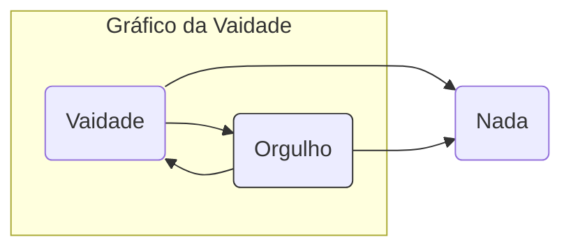

# Pecados, Uma Anatomia da Alma
Tags: #livro #filosofia #bíblia #pecado #curso
Referência: [Pondé - Hotmart](https://pecadosumaanatomiadaalma.club.hotmart.com/)

# INTRODUÇÃO
<iframe width="560" height="315" src="https://www.youtube.com/embed/y5hiLJnr1io" frameborder="0" allow="accelerometer; autoplay; encrypted-media; gyroscope; picture-in-picture" allowfullscreen></iframe>

* A auto-ajuda atrapalha o entendimento do problema que a mesma quer tratar.
* O entendimento do pecado como **light** atrapalha o entendimento do mesmo como compulsão.
* Iremos tentar entender se o homem é capaz de controlar o pecado através da exerção do livre arbítrio.
* O pecado é uma das formas de entendimento do mau.
* **[[Kierkegaard]]**, pai do existencialismo, entendia o pecado como a raiz da manifestação da angústia (situação onde o ser humano é acompanhado pela falta/abismo de onde o homem tenta escapar através de chaves de comportamento)
  * Para ele o homem fugia da angustia, de uma forma estética, através da procura ao prazer (muito sexo etc). Há um esgotamento deste estado estético em fuga da angústia por ser limitado, onde se alcança uma falta de interesse mesmo antes do prazer.
* Após frustrar-se com a fuga, o pecador enfrenta um desespero por não conseguir escapar da angústia. Podemos identificar os seguintes estágios:
  1.  **Estagio ético:** é outra foram de escapar do pecado e da angústia, que também falha por tornar-se uma pessoa infeliz ao tentar ser totalmente reto, voltando também para o desespero e desesperança.
  2.  **Primeiro estágio religioso:** Outro estágio é tentar viver segundo a doutrina de alguma igreja. Também finda no fracasso, pois os homens e as igrejas não são perfeitos (instituições eclesiais que servem poderes econômicos e políticos), levando ao desespero também.
  3.  **Segundo estágio religioso (solução do filósofo):** Solução mais kantiana, onde as atitudes tem princípios racionais (racionalização da moral). Salto na fé (única solução para a fuga do desespero) é acreditar que Deus está com você mesmo você sendo quem você é.
---
# PERSONAGENS E COMPORTAMENTO
<iframe width="560" height="315" src="https://www.youtube.com/embed/LzYZBJ3wX3E" frameborder="0" allow="accelerometer; autoplay; encrypted-media; gyroscope; picture-in-picture" allowfullscreen></iframe>

## INTRODUÇÃO
* Existem dois exemplos — Jacó e  Davi com Betsabá — que mostram que mesmo através do arrependimento do pecado e da admissão de sua situação pecadora consegue-se uma relação relativamente íntima com Deus.
* Não é porque a história começa com a punição em Adão e Eva que Deus faça o tempo inteiro um certo discernimento entre aqueles seres humanos que reconhecem a sua própria condição — de pecador — e aqueles que vivem em uma negação contínua do pecado ou aqueles que embarcam numa espécie de viagem absolutamente pecadora o tempo inteiro insistindo no que a gente poderia chamar de direito ao pecado.
* Na narrativa bíblica os pecados aparecem como padrões de comportamento.
* A primeira tradução da [[Bíblia]] para o grego foi feita por 70 judeus estudiosos e é chamada de **septuaginta**.
* A [[Bíblia]] foi escrita em **hebraico**, **aramaico** e **grego**.
* **Hermenêutica**: parte filosófica que se utiliza dos diferentes níveis interpretativos de um texto.
* Só os pecadores verão a Deus.
* Eva deveria ser muito bonita, tentadora, porque Adão preferiu fazer o que ela disse à obedecer a Deus.
## CAIM E ABEL
* Abel o pastor e Caim o filho aparentemente menos amado.
* A narrativa aqui é a matriz do pecado da inveja, observado pela raiva de Caim ao ver que Deus gostava mais dos sacrifícios de Abel.
* “Por acaso sou eu guardião do meu irmão?” — No mundo hebraico guardião (שומר /**shomer**), significa pessoa que faz a vontade de Deus no mundo.

## NOÉ
* Filho de **Sete**, que era filho de Adão.
* É o primeiro guardião dos animais.
* Deus decide destruir os descendentes de Caim, pois eles tinham a vida pecaminosa (luxúria, violência, inveja etc).
* O cristianismo sistematiza futuramente o que está exposto como pecado nas narrativas iniciais da [[Bíblia]], apresentado através do comportamento e da natureza humana.
* Noé fica na arca durante 40 dias, que é o mesmo tempo que Jesus esteve no deserto jejuando (os católicos guardam 40 dias entre o carnaval e a semana santa - quaresma).
* Aparentemente Deus tentou salvar a humanidade do pecado.
* **Filhos de Noé**
  * **Sem:** Dá origem aos povos semitas (judeus e árabes) - que hoje estão no oriente médio.
  * **Cam:** Filho que deu os descendentes africanos.
    * **Nimrod:** é um rei poderoso descendente de **Cam**.
      * Inicia a construção de uma torre (**Torre de Babel**) porque queria chegar até Deus (aparentemente o pecado do orgulho).
      * Babel é Babilônia em aramaico (בבל).
      * Queria fazer com que os homens vivessem em companhia de Deus. Foi uma tentativa de, através da tecnologia, uma capacidade humana, chegar até Deus.
      * Metaforicamente, a multiplicação das línguas serve como o entendimento de que a sociedade se torna desagregada e desorientada e não consegue mais trabalhar em conjunto, não existindo mais a harmonia entre os seres humanos.

## ABRÃO (ABRAÃO)
* Vivia na mesopotâmia (iraque) e sai para buscar Canaã (Israel).
* Deus promete a Abraão que abençõaria a sua descendencia e que ela seria o povo de Deus (Judeus).
* Filhos de abraão
  * **Ismael:** filho de **Agar**, que dá origem dos povos árabes.
  * **Isaque**: filho da Sara (Sarai), origina o povo de Canaã (israelitas)
    * Tem dois filhos gêmeos, Esaú (mais forte e peludo) e Jacó (cuida das ovelhas e mais fraco).
## ESAÚ
* Podemos ver a presença da preguiça, pois trocou a benção da sua primogenitura por um prato de lentilhas.

## JACÓ (ISRAEL)
* Rouba a primogenitura do irmão, mentindo pelo pai, e foge para o deserto, se arrepende, tem um sonho com anjos e escadas que iam até o céu.
* Recebe o nome de **Israel**, após lutar com um anjo.
* Tem doze filhos, as que originam as doze tribos de Israel.
* Deus leva muito a sério quando um ser humano sofre com seus erros e se arrepende de te-los cometido.
* Podemos ver comportamentos similares de Jesus, exemplificado no “bom ladrão” e com a prostituta.

  > Só os pecadores verão a Deus. Deus é misericordioso e não resiste àqueles que se arrependem de seus pecados
## DAVI
* Davi seria um homem cheio de desejos (libidinoso) e ambição (quer ter mais do que tem).
* Se encanta com a **Betsabá**, mulher casada com o general Urias. Davi, tomado pela luxúria (desejos libidinosos) envia Urias para o fronte de batalha em uma “missão suicida” para morrer.
* O adultério de **Davi** e **Betsabá** caiem domínio público.
* Davi se arrepende de seus feitos e se humilha perante Deus.
* Davi é tido como um homem honesto.
* A relação de Deus para com o pecado não é só a lei, que gera a punição, mas também o reconhecimento da condição de pecador para que estes tenham uma vida reta.

## SALOMÃO
* É filho de **Davi** e **Betsabá**.
* É considerado o rei mais sábio da Israel antiga, tempo de reinado onde ocorreu o apogeu de Israel.
* Fica claro que Deus tem um carinho especial por aqueles que pecam e reconhecem o seu pecado.
---
# VAIDADE
**Bibliografia recomendada:**
	- Livro de Gênesis - Bíblia
	- A negação da morte - Ernest Becker
**Filmes**:
	- SEVEN, Os Sete Crimes Capitais. Direção de David Fincher,1995.
 ## A VAIDADE E O VAZIO
-  <iframe width="560" height="315" src="https://www.youtube.com/embed/VIRp30p9MRM" frameborder="0" allow="accelerometer; autoplay; encrypted-media; gyroscope; picture-in-picture" allowfullscreen>Not suported!</iframe>

-  O tema dos pecados deve ser tratado com reverência, que foi perdida devido a uma certa boçalidade típica do mundo moderno, consequência de acreditar que pelos avanços tecnológicos não deve-se tomar cuidado com pecado, compulsões e vícios.
- Os 7 pecados capitais foi determinado por [[São Tomaz de Aquino]]
  * Capital (cabeça do latim **capitis**) — cada pecado seria a **cabeça** de uma derivação de comportamentos opostos a certas virtudes.
* Iremos começar pela vaidade (orgulho se inclui) pela tradição sempre ter considerado como o primeiro e maior de todos os pecados.
* A serpente introduz um argumento de que Eva e Adão "se tornariam igual a Deus".
* Adão e Eva se lançam em um projeto insano — projeto **causa sui** — de se auto afirmar como autônomos e causa de si mesmos.
* A vaidade tem um vínculo com o vazio — **vanitas** —. A vaidade, orgulho ou libido soberba, é uma negação frontal desse vazio ontológico. Vazio que, além das crenças religiosas ou psicologias profundas comportamentais, é perceptível na tentativa de Adão e Eva em serem independentes de Deus. tal independência - **causa sui** - é a tentativa vã dos seres humanos de afirmarem que são autossuficientes - **coisa que não é verdade ontologicamente**.
* O vaidoso/orgulhoso é aquele que tenta esconder, um problema originário, o fato de que ele não consegue fazer tudo que ele quer ou ser tudo que ele quer, por isso ele tem que mentir, assim como fizeram Adão, ao culpar a Eva em uma tentativa de escapar da culpa - **o que ocorre na vaidade** -  e Eva.
* A vaidade está no topo da hierarquia dos pecados capitais pois ela fala de uma condição intrínseca do ser humano, que é o desespero que a gente sente por estar vagando sobre uma espécie de nada.
* A [[Fortuna Crítica]] latina sempre descreve a criação como algo **ex nihilo** — algo que foi tirado do nada. Por isso carregamos esse nada dentro de nós.
* O russo Nicolai Berdiaev, discípulo do Dostoiévski — do modo espiritual e filosófico — desenvolveu uma [[Filosofia]] dizendo que o grande desafio dos ser humano é como ele lida com esse nada que está dentro dele, nada que se manifesta de diversas formas.
  * Nada aqui significa um nada em ação:
    * Aquilo que você percebe quando perde a vontade de fazer alguma coisa — **mas você nega isso**.
    * Se olhar no espelho e perceber que não tem mais o corpo que teve algum dia.
    * 

## ORGULHO COMO CEGUEIRA
- <iframe width="560" height="315" src="https://www.youtube.com/embed/TS7yGGzeya8" frameborder="0" allow="accelerometer; autoplay; encrypted-media; gyroscope; picture-in-picture" allowfullscreen></iframe>

- A semântica discute o significado das palavras.
- Nós fomos retirados do nada por Deus.
	- O nada aqui é um que se manifesta de forma concreta, um princípio de negação contínua do ser.
	- Esse nada e vazio, traz medo, onde o resutlado desse medo é a tentativa de negar a sua existência (desse vazio), que se manifesta no pecado da **soberba**.
- A soberba e a vaidade tem suas delícias
	- O pecado é sempre caracterizado por uma dimensão de delícias
		- Se achar lindo na frente do espelho
		- Se achar o mais inteligente da terra
		- Perceber que todo mundo quer ser seu amigo, te procura porque você é bem sucedido ou coisas similares.
- A soberba da vaidade tem a dependência continua do reconhecimento do outro de que você é algo que você admira (lindo, maravilhoso, inteligente etc)
- A estratégia da vaidade de fazer com que não seja perceptível a suas fraquezas (velhice, falta de energia, doenças etc), o que é uma fuga da vanidade, é uma estratégia fracassada porque implica que um alguém externo sempre reforce a existência dessa fuga em você através de elogios.
- A vaidade destroi a cognição pelos seguintes danos:
	- **Danos cognitivos**	
		- A cognição é capacidade de percepção da realidade.
			- *gnose* do grego significa conhecimento.
			- A única verdade que o vaidoso enxerga é a própria beleza e a própria maravilha, por isso ele se torna cego.
	- **Danos epistêmicos**
		- Dano na capacidade de perceber na realidade o que seria falso e verdadeiro.
		- Está diretamente associado a um diálogo específico de **[[Platão]]** chamado **[[Teeteto]]**
			- Platão tenta estabelecer a diferença entre o que é a sabedoria verdadeira e o que seria a pura *doxa* (do grego: opinião).
	- A vaidade interna, o orgulho interno, é muito pior do que orgulho externo, porque ela faz com que você não enxergue um palmo adiante do nariz, não produzindo sensação de desconforto (é muito pior do que botóx).
- O oposto da vaidade não é a humilhação

## VAIDADE E PROSPERIDADE: MENTIRAS CONTEMPORÂNEAS
<iframe width="560" height="315" src="https://www.youtube.com/embed/gKG9XZB8zhw" frameborder="0" allow="accelerometer; autoplay; encrypted-media; gyroscope; picture-in-picture" allowfullscreen></iframe>

- A vaidade é um conceito muito antigo
	- É construido a partir das narrativas Bíblicas
	- A Bíblia situaria Gêneses^[Livro provavelmente escrito por Moisés em torno de [[1250 a.C.]]] antes de Cristo.] muito antes de cristo porém a arqueologia situa para em torno do século VII antes de cristo.
- [[Mito de Narciso|Narcisismo]], sem entrar no mérito técnico da psicanálise froidiana, será usado como um sentido amplo psicológico, mais associado ao vínculo com o mito do narciso, que vê sua imagem no lago e se apaixona pela imagem, pulando no lago e morrendo.
	- Narciso é uma vítima do apaixonamento por si mesmo.
- A vaidade e o orgulho tem uma imbricação profunda com a ideia de narcisismo, excessivo amor próprio e ideias de autocentrismo.
	- Podemos perceber que existem vários livros dizendo que as pessoas são maravilhosas e que elas irão conseguir tudo sozinhas.
	- Psicoterapias da vaidade, se é que podem ser chamadas assim, estão associadas a técnica do ***coaching**^[Terapia para resolução de carreira]*.
		- Daqui se percebe toda uma técnica e **marketing** da vaidade.
			- Existe toda uma tecnologia e marketing para fazer com que as pessoas irão conseguir chegar lá sim, mesmo com 60 anos, que vai conseguir ser reaproveitado, o que não é bom pois deveria-se aceitar que está mesmo no fim do poço.
			- Essa indústria é canalha e sabe que a nossa cultura  optou pela vaidade, onde as mentiras são sustentadas até o fim.
- O envelhecimento é uma ferida narcísica.
	- Ser demitido aos 58 anos é uma experiêcia do vazio.
	- Não há atração de pessoas interessadas, querendo fazer sexo ou querendo trabalhar com pessoas velhas.
	- O mundo para o velho não é mais tão interessante como era.
	- A pessoa velha sente que não tem mais muito a dar para o mundo.
	- O narcísico fica o tempo todo tentando preencher com a negação do prórpio sofrimento e vai para um profissional que diz que irá dar a chave para a pessoa sempre vencer e conseguir se autorreafirmar.
- Não tem manifestação mais arrasadora do nada do que a obrigação de você ter que vencer o tempo inteiro.
	- Enquanto não há a percepção de que é necessário perder, nunca se sai da fuga do nada, que é demonstrado através dessa busca pela vitória contínua enlouquecida.
- Essa busca incessante pela vitória e a não aceitação da derrota é uma das melhores formas para adoecer.

## HUMILDADE: A VIRTUDE IMBATÍVEL
<iframe width="560" height="315" src="https://www.youtube.com/embed/XoVfTUGu_fg" frameborder="0" allow="accelerometer; autoplay; encrypted-media; gyroscope; picture-in-picture" allowfullscreen></iframe>

- Revisão:
	- A vaidade tem uma longa história, com credencias bíblicas e filosóficas.
	- A vaidade não é só externa, e é pior ainda quando é só interna.
	- A vaidade causa danos cognitivos e epistêmicos, onde a única verdade para o vaidoso é a verdade que reforça a sua própria vaidade.
	- A vaidade causa dano cognitivo porque impede que você perceba a realidade, onde a realidade do vaidoso é o desespero pela negação do nada e a negação contínua desse vazio e nada.
	- A vaidade causa danos afetivos, através de feridas narcísicas.
	- Hoje existe uma característica profunda de existir uma tecnologia ou gestão da vaidade
- Nos anos 1990, exitiram treinamentos de aut ajuda, chamados de **auto-programação neuroliguística**, da qual deriva toda a coaching, onde você coloca toda a sua vida em uma planilha de excel.
	- A pessoa fica repetindo e falando na frente do espelho que vai vencer.
		- A personagem [[Annette Bening]], no filme [[Beleza americana]], filme dos anos 2000, a net Bening fazia isso.
- A vaidade é um pecado profundo que se manifesta de diferentes formas mas que está sempre associado a essa fuga do vazio do nada e do fracasso.
- Nunca deve ser dito que alguém é esforçado, pois isso é o mesmo que dizer que alguém é meio "burrinho" mas que combate a própria dificuldade.
- A ética utilitária, do final do século XIII e início do século IXX ja havia identificado que a humilhação continua de uma pessoa produz um mal estar e que acaba destruindo a capacidade dela de investir na vida.
> De todas as virtudes, a humildade é a mais imbatível.
> —	[[George Bernanos | George Bernanos]]

- A humildade é uma virtude essencial
	- Ela dá o reconhecimento da condição ontológica em que você vive como também te prepara e protege do pânico diante dessa posição
	- É uma condição afetiva em que você não tem uma necessidade contínua de negar o tempo todo o vazio que existe dentro das pessoas.
	- Não é uma espécia de vitória ou negação do vazio, porque esta negação é o erro epistêmico, cognitivo e afetivo.
	- A humildade começa a aparecer quando se reconhece que tem medo do vazio.
	- O próprio Cristo é uma figura humilde mesmo ele sendo Deus.
		- Abraão, quando vai negociar a destruição de Sodoma e Gomorra com Deus, sempre se apresentava dizendo que era pó e cinzas.
		- Até hoje no judaismo quando se ora e se refere a Deus e o chama de Nosso Senhor e Nosso Rei se faz referência e fala-se sobre essa condição de pó.
			- Essa condição de pó se manifesta antes de tudo em uma certa calma, um certo reconhecimento de que não se consegue jogar fora esse sentimento de nada, e que talvez esse reconhecimento de que não irá vencer ajude a integrar esse vazio.
- O filósofo [[Søren Kierkegaard | Kierkegaard]]	quando falava do salto na fé está presente a ideia de que você está caindo no abismo.
	- A vida é uma espécie de pulo no abismo, porém tem diversões ao longo do caminho. Ninguém aguenta vertigem o tempo inteiro.
- A ideia de integração do vazio é que vai levar a uma postura de humildade, onde há o autorreconhecimento, sabendo que de partida já se perdeu a batalha ontológica.